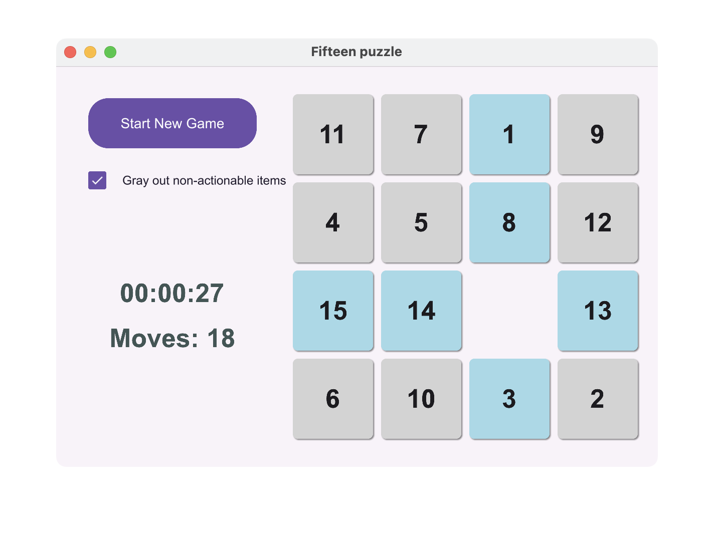

# Fifteen puzzle

Old Simple game where you have to order the numbers from 1 to 15 in a 4x4 grid.

## About

This is a small pet project to learn [Slint](https://slint.dev) and [Rust](https://www.rust-lang.org/).

## Usage

Just download the binary from Releases and run it.

## Development

Look into [taskfile.yml](./taskfile.yml) for the available commands.

## Takeaways

1. Slint is a nice tradefoff between a full blown html/css-like frameworks and pure native solutions.
2. Resulting binary is quite small compared to Electron or Qt, but not as small as I'd imagine (aroind 10M).
